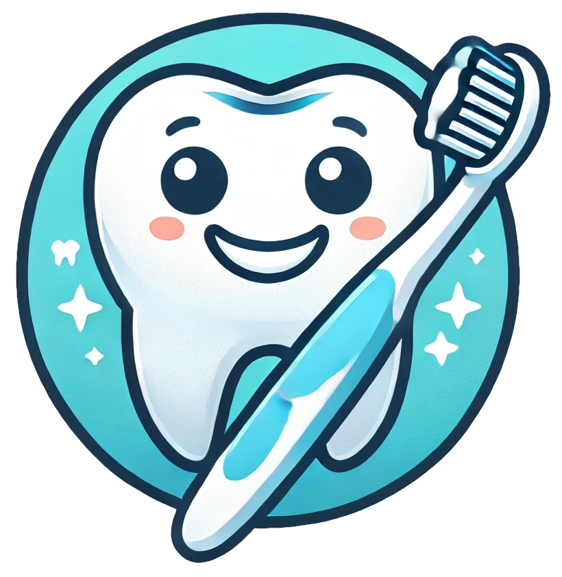

# USMILE Telegram Bot

<p align="center">
    
</p>

Телеграм бот для создания партнерских сертификатов стоматологии usmile

## Техническая информация

### Стек

- [Python3](https://www.python.org/)
- [Aiogram3](https://aiogram.dev/)
- [Peewee](https://github.com/coleifer/peewee)
- [Docker](https://www.docker.com/)
- [Docker Compose](https://docs.docker.com/compose/)
- [PostgreSQL](https://www.postgresql.org/)

### Запуск

#### Продакшен

```bash
docker compose --profile prod up --build -d
```

#### Разработка

```bash
docker compose --profile dev up --build
```
